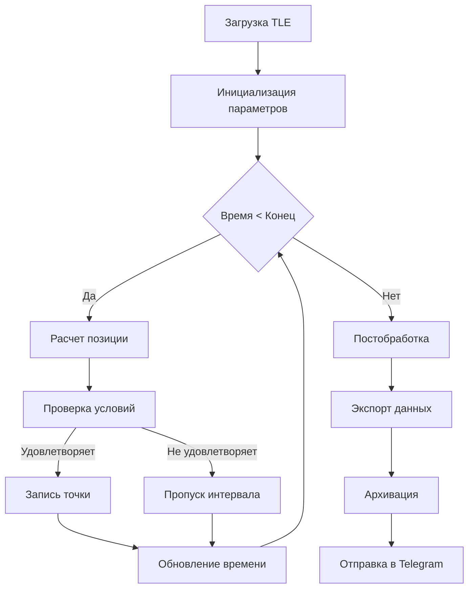
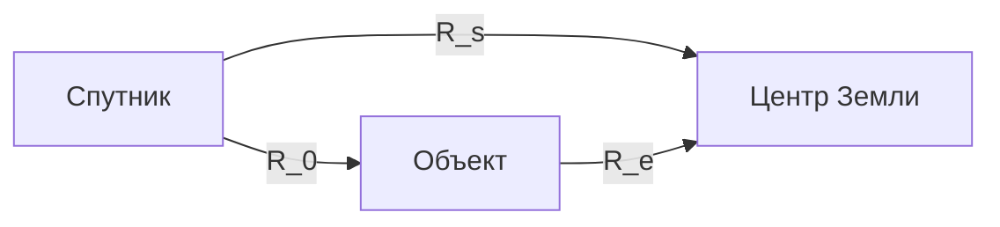

```markdown
# Satellite Observation Planner 🛰️

[Предыдущие разделы остаются без изменений...]

## 🚦 Запуск в качестве демона (Linux)

### Системные требования
- Linux с systemd
- Python 3.8+ в системном окружении
- Права superuser

### Инструкция

1. Создайте сервисный файл:
```bash
sudo nano /etc/systemd/system/satellite-planner.service
```

2. Вставьте конфигурацию:
```ini
[Unit]
Description=Satellite Observation Planner Daemon
After=network.target

[Service]
Type=simple
User=ubuntu
WorkingDirectory=/path/to/project
ExecStart=/usr/bin/python3 /path/to/project/main.py
Restart=always
RestartSec=30
StandardOutput=syslog
StandardError=syslog
SyslogIdentifier=satellite-planner

[Install]
WantedBy=multi-user.target
```

3. Активируйте и запустите службу:
```bash
sudo systemctl daemon-reload
sudo systemctl enable satellite-planner
sudo systemctl start satellite-planner
```

### Управление службой
| Команда                     | Описание                  |
|-----------------------------|---------------------------|
| `sudo systemctl start satellite-planner` | Запустить службу         |
| `sudo systemctl stop satellite-planner`  | Остановить службу        |
| `sudo systemctl status satellite-planner` | Показать статус         |
| `journalctl -u satellite-planner -f`      | Просмотр логов в реальном времени |

## 🧠 Характеристики алгоритма

### Основные параметры
```yaml
Точность расчетов:
  - Позиция спутника: ±50 метров
  - Временные метки: ±10 мс
  - Угловые параметры: ±0.1°

Производительность:
  - Обработка 1 витка: < 1 сек
  - Макс. длительность расчета: 72 часа
  - Потребление памяти: < 100 MB

Оптимизации:
  - Адаптивный шаг расчета
  - Бинарный поиск границ зон
  - Кеширование орбитальных параметров
```

### Блок-схема алгоритма


## Алгоритм работы

1. **Инициализация орбиты**:
   - Загрузка TLE-данных спутника.
   - Расчет начальных позиций спутника и наземной цели.

2. **Поиск переходов между витками**:
   - Анализ пересечения экватора (`find_orbit_transitions`).
   - Бинарный поиск точного времени перехода (точность до 10⁻⁶ сек).

3. **Параллельный расчет условий съемки**:
   - Для каждого временного шага (`delta_obn`) рассчитываются:
     - Геодезические координаты спутника.
     - Углы визирования (`y_grad`, `ay_grad`).
     - Доплеровская частота (`Fd`).

4. **Определение зоны съемки**:
   - Проверка условий:
     - Угол визирования: `24° ≤ y_grad ≤ 55°`.
     - Угол места: `|ay_grad - angle_param| ≤ 2°`.

5. **Точное определение границ зоны**:
   - Бинарный поиск времени входа/выхода в зону (`find_exact_boundary`).

6. **Экспорт данных**:
   - Точки трека сохраняются в Shapefile.
   - Детальные параметры — в Excel.

---

## Математические основы

### 1. Векторные позиции
- **Спутник**:
  \[
  \mathbf{R}_s = (X_s, Y_s, Z_s), \quad \|\mathbf{R}_s\| = \sqrt{X_s^2 + Y_s^2 + Z_s^2}
  \]
- **Наземная цель**:
  \[
  \mathbf{R}_e = (X_t, Y_t, Z_t), \quad \|\mathbf{R}_e\| = \sqrt{X_t^2 + Y_t^2 + Z_t^2}
  \]
- **Расстояние между спутником и целью**:
  \[
  \mathbf{R}_0 = \mathbf{R}_s - \mathbf{R}_e, \quad \|\mathbf{R}_0\| = \sqrt{(X_s - X_t)^2 + (Y_s - Y_t)^2 + (Z_s - Z_t)^2}
  \]

### 2. Углы визирования
- **Угол визирования (γ)**:
  \[
  \gamma = \arccos\left(\frac{\|\mathbf{R}_0\|^2 + \|\mathbf{R}_s\|^2 - \|\mathbf{R}_e\|^2}{2 \|\mathbf{R}_0\| \|\mathbf{R}_s\|}\right)
  \]
- **Угол места (α)**:
  \[
  \alpha = \arccos\left(\frac{\|\mathbf{R}_0\| \sin(\gamma)}{\|\mathbf{R}_e\|}\right)
  \]

### 3. Доплеровская частота
\[
F_d = \frac{2 V_s}{\lambda} \cos(\alpha) \sin(\gamma)
\]
где:
- \( V_s \) — скорость спутника,
- \( \lambda \) — длина волны.

---

### Ключевые особенности
1. **Гибкая модель расчета**
   - Поддержка различных TLE-форматов
   - Настраиваемые параметры наблюдения
   - Динамическая коррекция шага

2. **Эффективный поиск зон видимости**
   - Трехэтапный алгоритм:
     1. Быстрый проход с крупным шагом
     2. Уточнение границ бинарным поиском
     3. Верификация геометрических условий

3. **Ресурсоэффективная реализация**
   - Минимизация операций с плавающей точкой
   - Векторизованные вычисления
   - Пакетная обработка данных

4. **Отказоустойчивость**
   - Автоматическое восстановление при ошибках
   - Контроль целостности данных
   - Резервное копирование промежуточных результатов

---

## Лицензия
Проект распространяется под лицензией MIT. Подробнее см. в файле [LICENSE](LICENSE).

# Математическая модель 📐

## Геометрические соотношения

### 1. Основные формулы расчета

**Расстояние спутник-объект**  
\[
\boxed{R_0 = \sqrt{(X_s - X_t)^2 + (Y_s - Y_t)^2 + (Z_s - Z_t)^2}}
\]
*где:*  
- \(X_s, Y_s, Z_s\): Координаты спутника в инерциальной системе  
- \(X_t, Y_t, Z_t\): Координаты цели в инерциальной системе  

**Угол визирования (γ)**  
\[
\boxed{\gamma = \arccos\left(\frac{R_0^2 + R_s^2 - R_e^2}{2R_0R_s}\right)}
\]


**Угол места (α)**  
\[
\boxed{\alpha = \arccos\left(\frac{R_0 \sin\gamma}{R_e}\right)}
\]

---

## Доплеровская модель

### 2. Частота Доплера
\[
\boxed{F_d = \frac{2V_s}{\lambda} \cos\alpha \sin\gamma}
\]

**Компоненты формулы:**  
| Элемент | Физический смысл |
|---------|------------------|
| \(V_s\) | Абсолютная скорость спутника |
| \(\lambda\) | Длина волны излучения |
| \(\cos\alpha\) | Проекция скорости на направление наблюдения |
| \(\sin\gamma\) | Геометрический фактор видимости |

---

## Система обозначений

### Геометрические параметры
| Символ | Описание | Ед. изм. | Диапазон |
|--------|----------|----------|----------|
| \(R_s\) | Норма вектора спутник-Земля | км | 6571-7371 |
| \(R_e\) | Норма вектора объект-Земля | км | ≈6378.1 |
| \(R_0\) | Дистанция спутник-объект | км | 500-2500 |
| \(\gamma\) | Угол между векторами \(R_s\) и \(R_0\) | ° | 24-55 |
| \(\alpha\) | Угол места относительно горизонта | ° | 0-90 |

### Физические константы
```math
\begin{aligned}
\text{Радиус Земли: } & R_{\oplus} = 6378.140\ \text{км} \\
\text{Скорость света: } & c = 299792458\ \text{м/с} \\
\text{Стандартная гравитация: } & g = 9.80665\ \text{м/с}^2
\end{aligned}
```

---

## Пример расчета
Для типичных условий:
- Высота орбиты: 600 км
- Скорость спутника: 7.8 км/с
- Длина волны: 0.096 м

**Результаты:**  
\[
\gamma = 32.5°,\quad \alpha = 45.1°,\quad F_d = 1843\ \text{Гц}
\]

> **Примечание:** Все расчеты учитывают сферичность Земли и преобразование между системами координат
``` 
